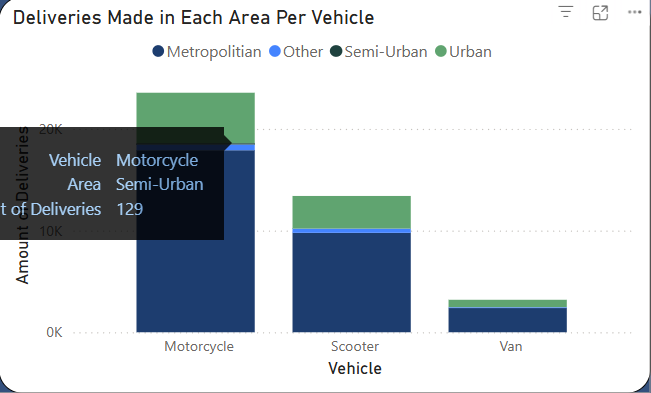

# Using BI to Optimize Last-Mile Logistics

# Objective:
This project explores a large dataset of Amazon deliveries to uncover insights that can improve delivery efficiency and optimize operations. The analysis focuses on customer behavior, delivery performance, product trends, and traffic impacts—both overall and by area.

# 1. Ask the Right Questions (Define the Problem)

## Guiding Questions:

   - What factors affect delivery efficiency?  
   - Which product categories are most and least popular?  
   - How do traffic, delivery area, and vehicle type impact transit time?  
   - When are orders most frequently placed?  
   - What patterns exist in agent performance across different conditions?  

# 2. Collect the Data

## Dataset Source:

The dataset used for this analysis was downloaded from Kaggle and can be found at [Amazon Delivery Dataset](https://www.kaggle.com/datasets/sujalsuthar/amazon-delivery-dataset)

## Key Features:

**Size**: 43,648 rows x 16 columns

**Features**:

 - `Order_ID`
 - `Agent_Age` (numeric)
 - `Agent_Rating` (decimal)
 - `Transit_Time` (in minutes)
 - `Traffic`, `Weather`, `Vehicle` (categorical)
 - `Area`, `Order_Date`, `Category`

# 3. Clean & Prepare the Data

## Data Cleaning Tasks:

   - Removed invalid geolocation values (e.g., stores lat/lon = 0 - in the Indian Ocean)

   |||
   |:-:|:-:|
   |Before|After|
  
   - Dropped rows with a blank in the `Transit_Time` column to preserve metric integrity 

   

   - Standardized data types (e.g., converted agent age from string to integer)
   
   - Capitalized first letter of `Vehicle` types for better visuals

## Feature Engineering:

   - Created `Month`, `Weekday`, `Weekday_Name` columns using Power Query date functions

   ||||
   |:-:|:-:|:-:|

   - Built `Time_of_Day` column using DAX SWITCH() for Morning/Afternoon/Evening/Night

   - Created `Amount_Of_Orders` measure to track volume

   |||
   |:-:|:-:|

   - Ensured bar chart would be sorted by `Weekday_Name` using numerical `Weekday` values

   

# 4. Analyze the Data

## Descriptive & Exploratory Analysis:

   - Majority of deliveries were made to Metropolitan areas (30K+ orders)

   - Motorcycles were the most used delivery vehicle across all areas

   - Evenings had the highest order activity, especially on Wednesdays and Sundays

   - Electronics, books, and jewelry were the top products purchased

   |||
   |:-:|:-:|

## Time-Series Trends:

   - Significant order increases from Feb 18 – Mar 1 (likely due to end-of-month promotions)

   - March had the most complete data; February and April had partial coverage

   - Delivery times varied significantly based on traffic and area:  

        Fastest: low-traffic urban areas  

        Slowest: semi-urban in high traffic
     
|||
|:-:|:-:|

## Traffic Pattern Insights:

   - Jammed traffic = longest average transit times (148 mins), lowest ratings

   - Low traffic = quickest deliveries (101 mins), highest ratings

|||
|:-:|:-:|

# 5. Share & Visualize Results

## Dashboard Features:

    Multi-filtered views (by area, traffic, time of day, etc.)

    KPIs for agent ratings, transit times, order volumes

    Charts for order frequency by weekday, time of day, and product category

    Scaled Y-axis for Avg Transit Time Throughout the Week for consistent interpretation

# 6. Act (Draw Conclusions & Recommend Actions)

## Key Takeaways:

    Optimize routing based on area, traffic, and time of day

    Promote motorcycle usage for congested zones

    Use delivery trends to better forecast demand and staffing needs

    Evening hours (esp. Wednesdays/Thursdays) offer high delivery efficiency

    Monitor agent ratings as a proxy for customer satisfaction and delivery time

    Improve semi-urban logistics by possibly expanding warehouse coverage
