# Warehouse Performance Analysis - Part 2   
click [here](https://github.com/ShaunJPartridge/Data-Analytics-Portfolio/tree/main/SQL/Warehouse%20Performance%20Analysis) for Part 1

### 5. Share & Visualize Results  

## Warehouse Operations Section  

|Mean Absolute Error|Warehouse Turnaround Time vs Company Average|Total Orders per Warehouse|
|---|---|---|
|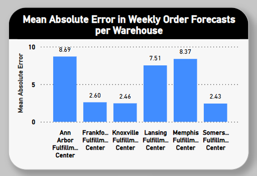|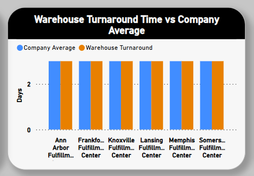|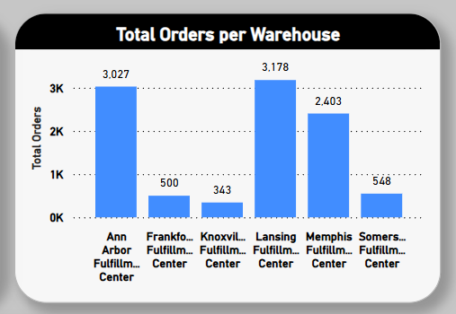|  

**Actual vs Forecasted Orders by Warehouse**

|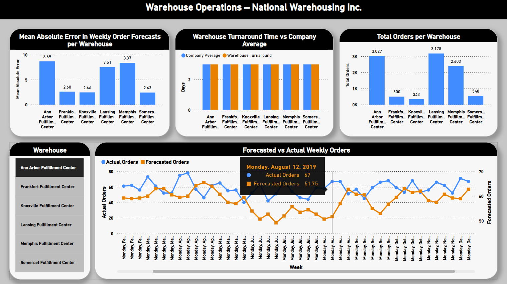|
|---|
|Ann Arbor Fulfillment Center|

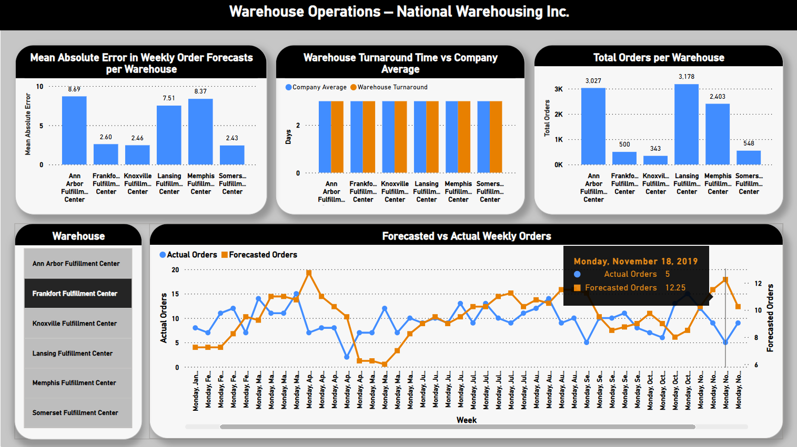|  
|---|
|Frankfort Fullfillment Center|

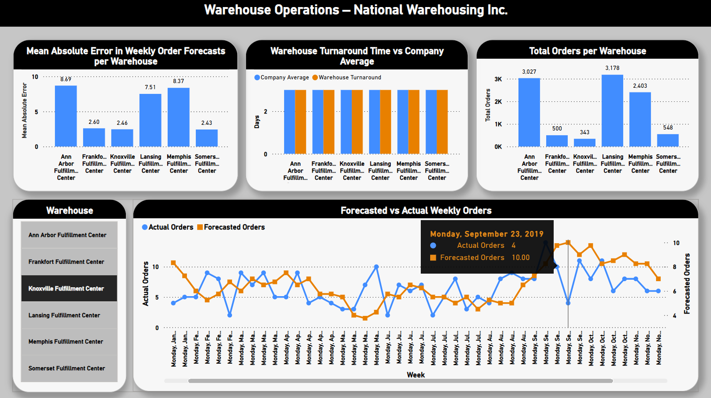|  
|---|
|Knoxville Fullfillment Center|

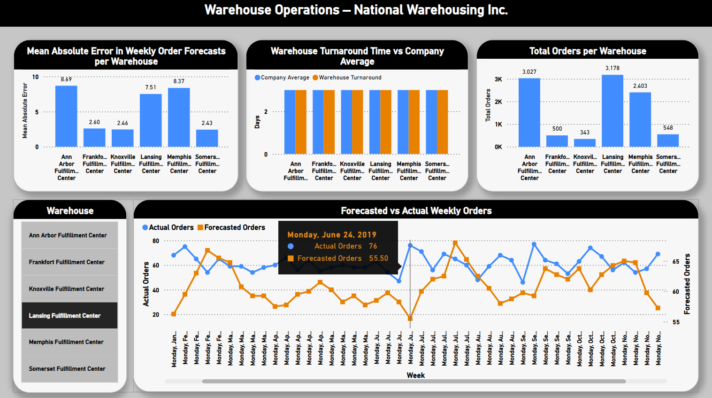|  
|---|
|Lansing Fullfillment Center|

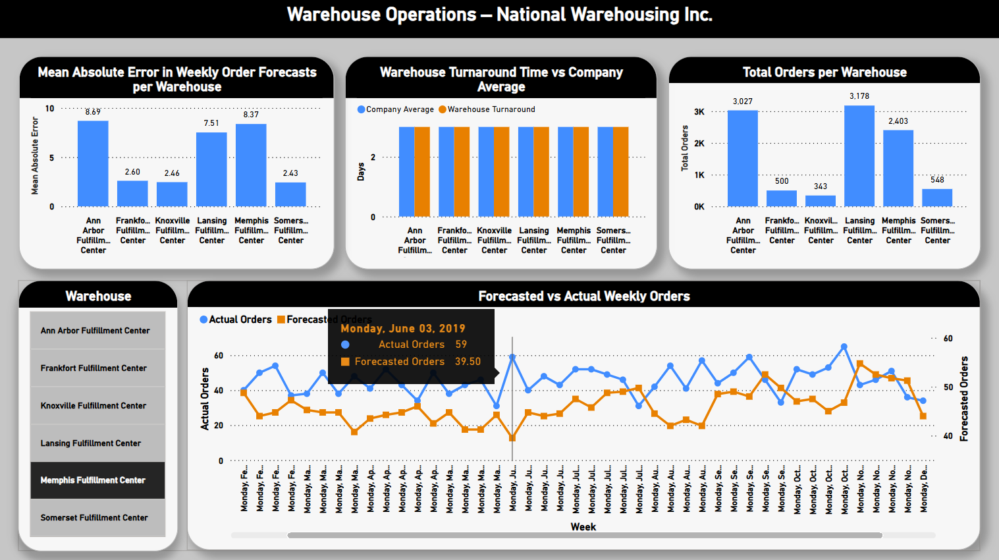|  
|---|
|Memphis Fullfillment Center|

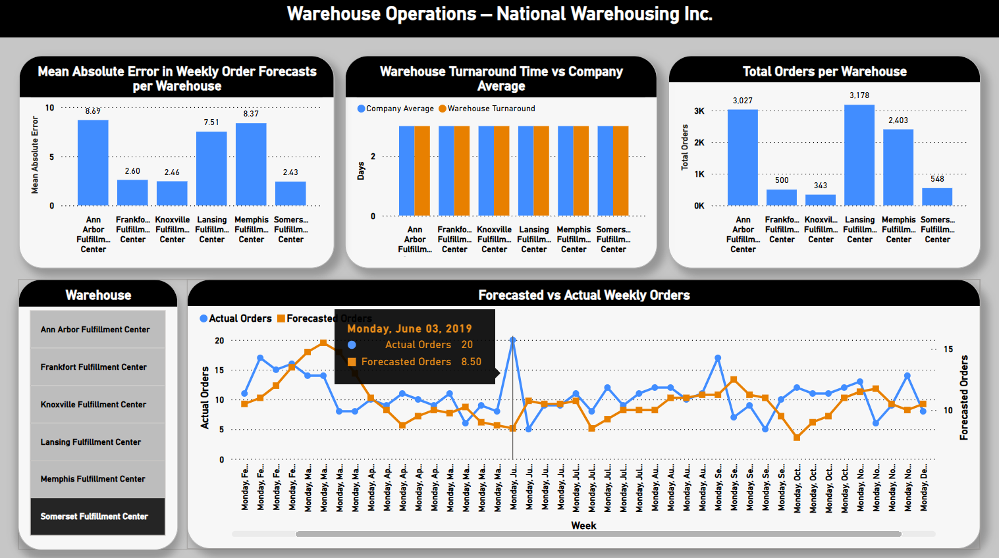|  
|---|
|Somerset Fullfillment Center|

## Customer Insights Section

|Returning Customers|Total Customers|Customer Return Rate|Average Days Between Orders|
|---|---|---|---|
|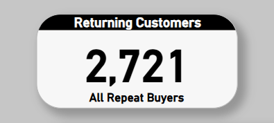|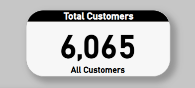|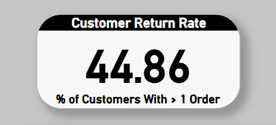|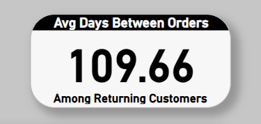|

**Returning Customers Over Time**  

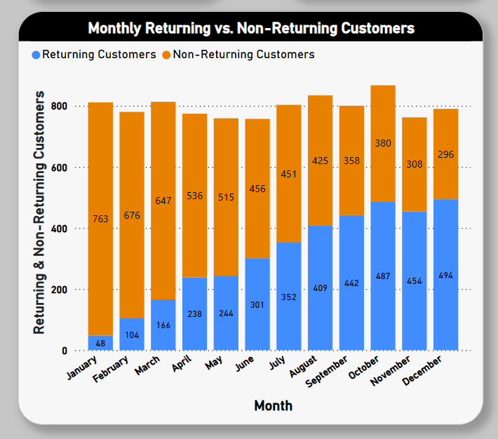

**Returning Customers per Warehouse**  

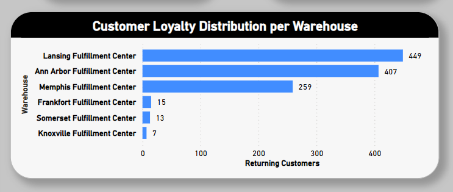

**Total Orders by State**  

|Michigan|Tennessee|Kentucky|
|---|---|---|
|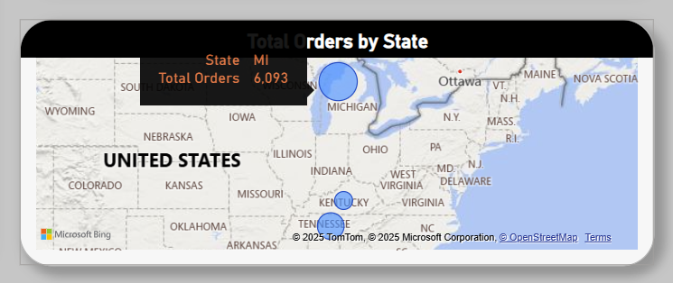|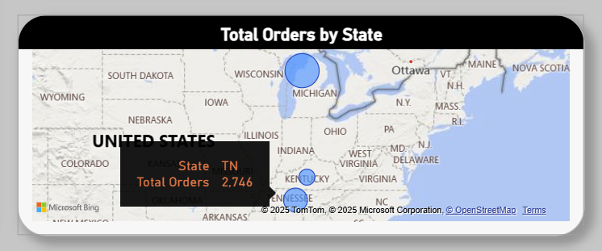|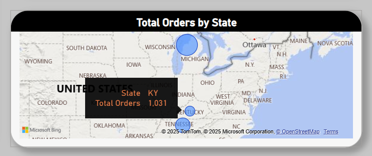|

**Customer Insights per Warehouse**  

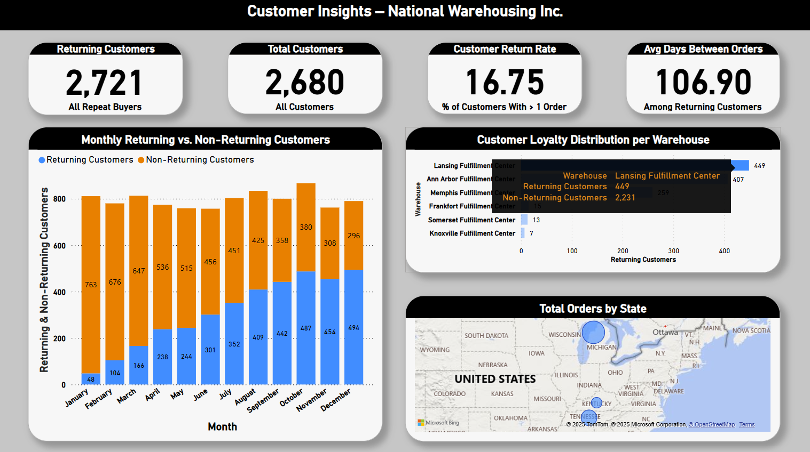|  
|---|
|Lansing Fullfillment Center|  

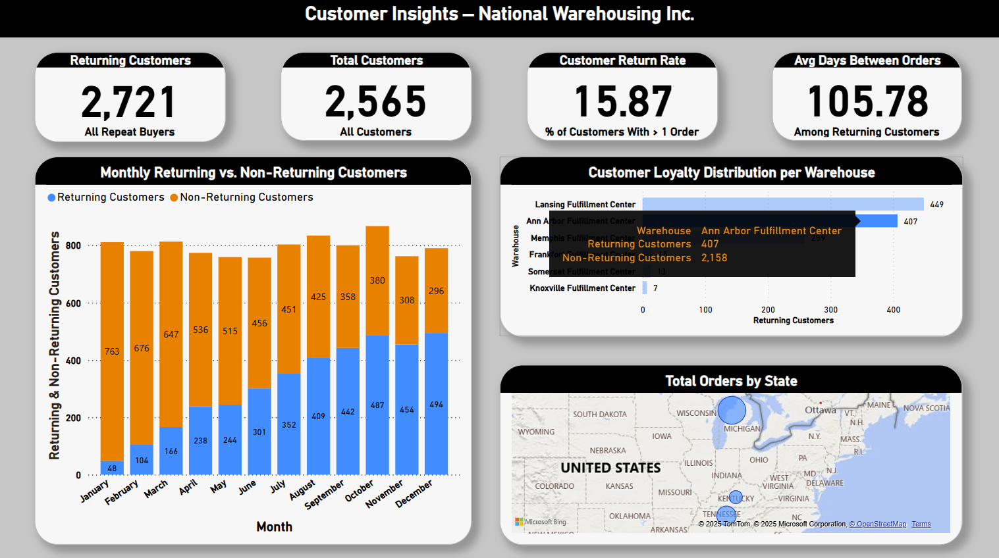|  
|---|
|Ann Arbor Fullfillment Center|  

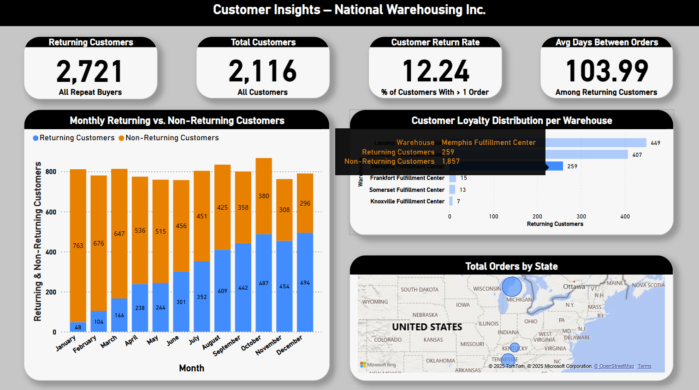|  
|---|
|Memphis Fullfillment Center|  

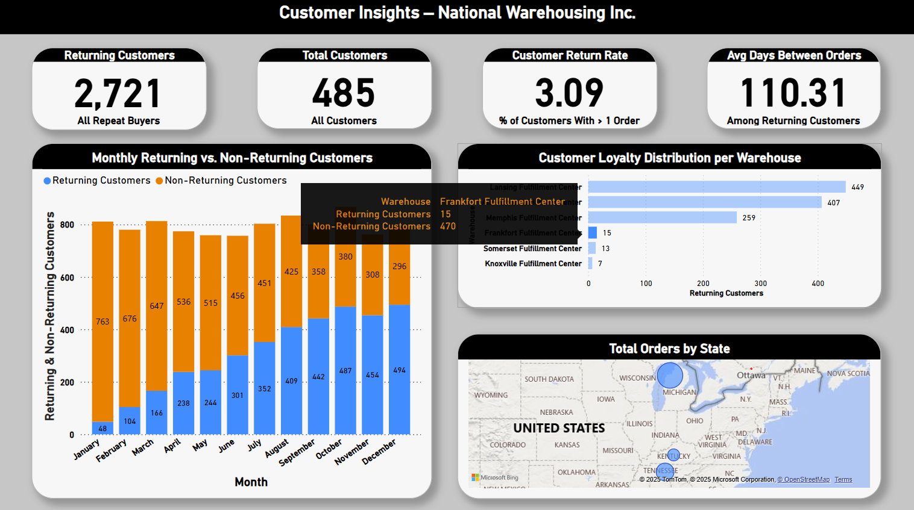|  
|---|
|Frankfort Fullfillment Center|  

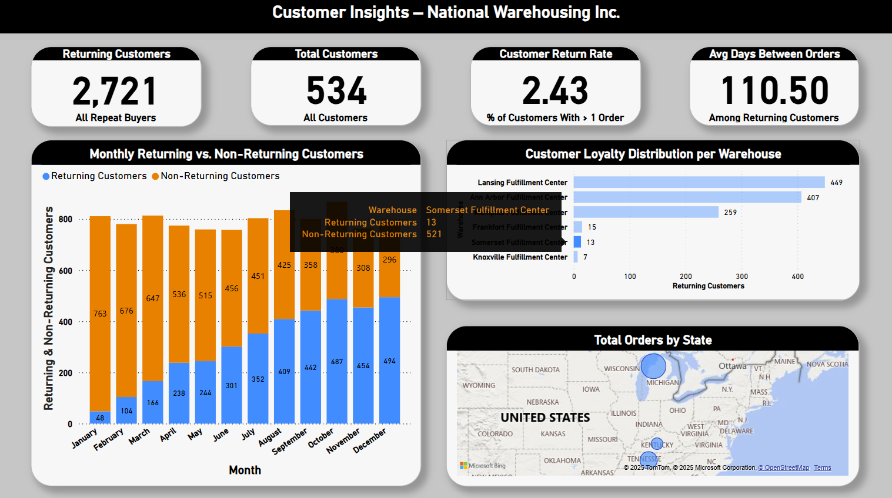|  
|---|
|Somerset Fullfillment Center|  

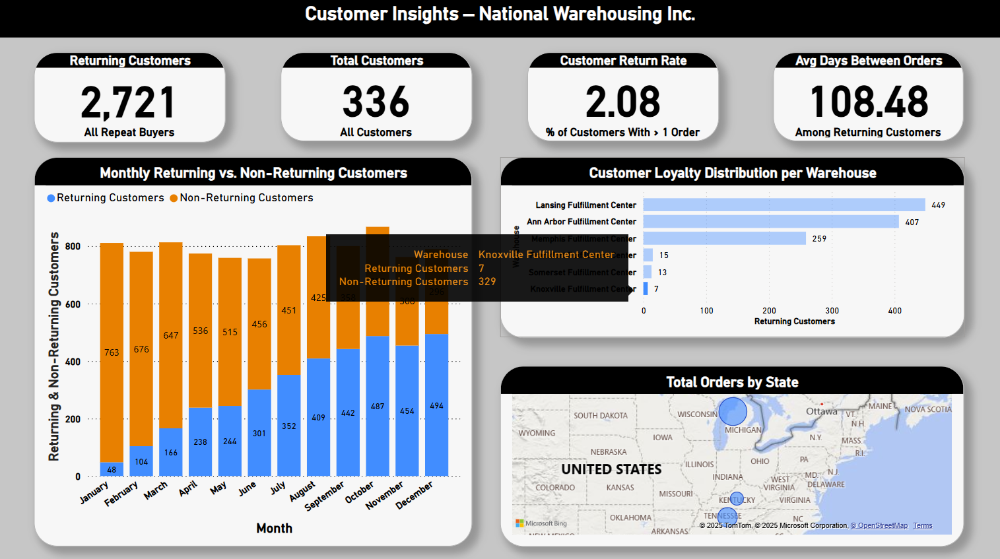|  
|---|
|Knoxville Fullfillment Center|

### 6. Act (Draw Conclusions & Recommend Actions)

## Key Takeaways:
