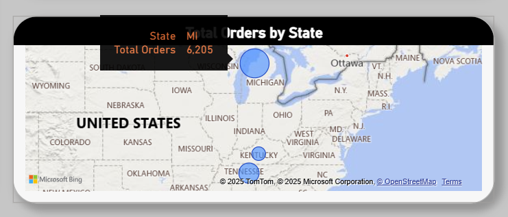
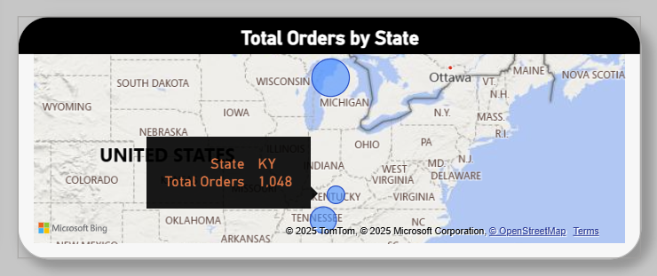

# Warehouse Performance Analysis - Part 2   
click [here](https://github.com/ShaunJPartridge/Data-Analytics-Portfolio/tree/main/SQL/Warehouse%20Performance%20Analysis) for Part 1

### 5. Share & Visualize Results  

## Warehouse Operations Section  

Three major stats (MAE, turnaround time, and total orders) are presented for all warehouses to show their performance againt one another.  

**Mean Absolute Error:**  
At its core, [MAE](https://www.numberanalytics.com/blog/mastering-mean-absolute-error) quantifies the average magnitude of errors in a set of predictions, without considering their direction (i.e., whether the errors are positive or negative). In the context of this analysis, the MAE measures the accuracy of warehouse demand forecasting. Below, are the MAE's for each warehouse.   

**Warehouse Turnaround Time vs Company Average:**  
The average order turnaround time for each warehouse was examined using the company average of 3 days as a benchmark to evaluate order fulfillment performance. Results are below.

**Total Orders per Warehouse:**   
The total amount of orders for each warehouse illustrates customer demand and can be seen below.

|  

**Actual vs Forecasted Orders by Warehouse:**  
Below, are the weekly actual and forecasted orders trend lines for each warehouse over the year.

||
|---|
|Ann Arbor Fulfillment Center|

|  
|---|
|Frankfort Fullfillment Center|

|  
|---|
|Knoxville Fullfillment Center|

|  
|---|
|Lansing Fullfillment Center|

|  
|---|
|Memphis Fullfillment Center|

|  
|---|
|Somerset Fullfillment Center|

## Customer Insights Section

|Returning Customers|Total Customers|Customer Return Rate|Average Days Between Orders|
|---|---|---|---|
|||||

**Returning Customers Over Time**  

**Returning Customers per Warehouse**  

**Total Orders by State**  

|Michigan|Tennessee|Kentucky|
|---|---|---|
||||

**Customer Insights per Warehouse**  

|  
|---|
|Lansing Fullfillment Center|  

|  
|---|
|Ann Arbor Fullfillment Center|  

|  
|---|
|Memphis Fullfillment Center|  

|  
|---|
|Frankfort Fullfillment Center|  

|  
|---|
|Somerset Fullfillment Center|  

|  
|---|
|Knoxville Fullfillment Center|

### 6. Act (Draw Conclusions & Recommend Actions)

**Overall Warehouse Insights:**  

The Somerset Fulfillment Center is the most accurate facility when it comes to forecasting orders with a MAE of 2.43, the Knoxville Fulfillment Center is right behind it at 2.46, and then the Frankfort Fulfillment Center at 2.60. The Ann Arbor warehouse has the biggest gap between it's actual and forecasted orders with a MAE of 8.69, followed by the Memphis Fulfillment Center's MAE is 8.37, and then the Lansing Fulfillment Center at 7.51.

The avg turnaround time to fulfill orders is 3 days, company-wide.

The Lansing Fulfillment Center has the most orders at 3,178, Ann Arbor had the 2nd most at 3,027, and Memphis ranks 3rd in orders at 2,403. The Somerset, Frankfort, and Knoxville Fulfillment Centers have 548, 500, & 343 orders.

**Overall Customer Insights:**  

Important note, a customer can return to multiple warehouses 

2,721 returning cutomers; 6,065 total customers; 44.86 customer return rate; avg days between orders 109.66 days

The amount of returning customers gradually increased throughout the year with a slight regression in November at 454. December seen the most returning customers at 494.

The Lansing Fulfillment Center has the most returning customers at 449 with 16.75 retention rate. Ann Arbor & Memphis followed at 407 (15.87) and 259 (12.24). Frankfort, Somerset,
and Knoxville warehouses have the least returning customers at 15 (3.09), 13 (2.43), and 7 (2.08).

Orders by State: Michigan - 6,093 orders, Tennessee - 2,691 orders, Kentucky - 1,031 orders

## Key Takeaways:

There are more days between orders at warehouses with low customer return rates compared to ones with higher ratings

Warehouses with less orders are more accurate at forecasting orders for the next week compared to high-volume warehouses. 

Warehouses with more orders have higher customer retention rates.

Most of the company's business is in Michigan, a quarter in Tennessee, and a fraction in Kentucky.
