# Telecom Customer Churn Analysis

## Data Analysis Process

### 1. Define the Problem

Telecom Co., a US-based telecommunications company that offers national and international phone services, is experiencing a high volume of customers canceling their phone service, which is costing the company thousands of dollars in losses.

**Business Goal:**
To solve this, I'm proposing a proactive solution to predict at-risk customers using Logistic Regression and Gradient Boosted Tree machine learning models and take action to prevent them from churning.

### 2. Collect & Store Data

The dataset will be scraped from an online source, [Kaggle](https://www.kaggle.com/datasets/mustafakeser4/bigquery-churn-dataset/data), and cleaned using a Python script.

In this script:

- Kaggle's API and pandas are used to authenticate the connection, extract the `.csv` file from the repository, and read it into a pandas DataFrame.

- It is then transformed back into a `.csv` file for the blob used to write to the GCS bucket.

- An instance of GCP's Storage client is initialized to gain access to the GCS bucket and upload the data.

- Once uploaded, an external BigQuery table is created by retrieving the dataset from the GCS bucket.

This table serves as a reference to create/update the final `churn-features` table, which is used to train the ML models and analyze in Power BI. In BigQuery, scheduled queries train the models and store results in native tables. Only the predictions from the most accurate model are analyzed in Power BI.


### 3. Clean & Prepare Data

Use Kaggle API and pandas to read in the dataset, and SQL to transform values, normalize features, and engineer churn indicators (`total_minutes`, `total_charges`, `total_calls`, `vm_plan`, `int_plan`, `tier`).

The function below, get_data, uses Kaggle's API and pandas to extract and load the data into GCP.

```
def get_data():

    # Authenticate with Kaggle API
    kaggle.api.authenticate()

    # Download the dataset
    kaggle.api.dataset_download_files(dataset, path='.', unzip=True)

    # Download the dataset metadata
    kaggle.api.dataset_metadata(dataset, path='.')

    # Read in .csv file into dataframe
    df = pd.read_csv(local_path)
    
    # Set values for GCS bucket and blob name
    blob_name = file_name
    df.to_csv(blob_name, index=False)

    # Initialize Storage client to access GCP storage bucket
    client = storage.Client(credentials=credentials, project=project_id)
    bucket = client.bucket(bucket_name)
    blob = bucket.blob(blob_name)
    blob.upload_from_filename(local_path)
```

**Data Cleaning & Transformations:**

Columns, `international_plan`, `voice_mail_plan`, and `churn` are cast from boolean to INT64 for the ML model.

The function below, `get_query_string`, does 90% of the transformation work.
```
def get_query_string(ext_table_id, ext_table):

    # Define the SQL query string
    return f"""
        WITH getTotals AS (
            SELECT  
                customer_id,
                TRUNC(SAFE_CAST(SUM(total_day_minutes + total_eve_minutes + total_intl_minutes + total_night_minutes) AS FLOAT64), 2) AS total_minutes,
                SAFE_CAST(SUM(total_day_calls + total_eve_calls + total_intl_calls + total_night_calls) AS INT64) AS total_calls,
                TRUNC(SAFE_CAST(SUM(total_day_charge + total_eve_charge + total_intl_charge + total_night_charge) AS FLOAT64), 2) AS total_charges
            FROM `{ext_table_id}`
            GROUP BY customer_id
        )
        
        SELECT
            TRIM(LOWER(final.customer_id)) AS customer_id,
            state,
            SAFE_CAST(account_length AS INT64) AS account_length,
            CASE WHEN international_plan = FALSE THEN 'No' ELSE 'Yes' END AS international_plan,
            CASE WHEN voice_mail_plan = FALSE THEN 'No' ELSE 'Yes' END AS voice_mail_plan,
            gt.total_minutes,
            gt.total_calls,
            gt.total_charges,
            SAFE_CAST(number_customer_service_calls AS INT64) AS number_customer_service_calls,            
            SAFE_CAST(churn AS INT64) AS churn
        FROM `{ext_table}` final
        LEFT JOIN getTotals gt
        ON final.customer_id = gt.customer_id
    """
```

The `getTotals` CTE aggregates totals using `SAFE_CAST` and `TRUNC` to ensure precision.

Trailing white spaces in `customer_id` are removed.

`international_plan` and `voice_mail_plan` are transformed to 'Yes' or 'No' for better readability in dashboard slicers.

The final table, `churn_features` is created using the SQL string and BigQuery's query function.

```
# Get query string to clean and transform the final table
    query = get_query_string(external_table_id, external_table)

    client.query(f"CREATE OR REPLACE TABLE `{project_id}.{final_table}` AS {query}").result()
```

Remaining transformations are handled in scheduled BigQuery queries and can be referenced below.

Get the churn predictions using Logistic Regression
```
/*
  This query will get the customers' predicted churn probability
  using the Logistic Regression model.
  
  Note: Accessed customers' churn probability by indexing
  the predicted_churn_probs array and getting the property,
  prob, from the struct
*/
CREATE OR REPLACE TABLE `customer_churn_data.customer_churn_probs_lr` AS 
SELECT
  customer_id,
  predicted_churn,
  predicted_churn_probs[0].prob AS churn_probability,
  CASE 
    WHEN predicted_churn_probs[0].prob < .40 THEN "Low-Risk"
    WHEN predicted_churn_probs[0].prob >= .40 AND predicted_churn_probs[0].prob < .70 THEN "Medium-Risk" ELSE "High-Risk"
  END AS tier
FROM ML.PREDICT(
  MODEL `customer_churn_data.churn_model_logistic`,
  (
    SELECT *
    FROM `customer_churn_data.churn_features`
  )
)
ORDER BY churn_probability DESC;
```

Get the churn predictions using Gradient Boosted Trees
```
/*
  This query will get customers' predicted churn probability
  using the Gradient Boosted Tree model.
  
  Note: Accessed customers' churn probability by indexing
  the predicted_churn_probs array and getting the property,
  prob, from the struct
*/
CREATE OR REPLACE TABLE `customer_churn_data.customer_churn_probs_gbt` AS
SELECT
  customer_id,
  predicted_churn,
  predicted_churn_probs[0].prob AS churn_probability,
  CASE 
    WHEN predicted_churn_probs[0].prob < .40 THEN "Low-Risk"
    WHEN predicted_churn_probs[0].prob >= .40 AND predicted_churn_probs[0].prob < .70 THEN "Medium-Risk" ELSE "High-Risk"
  END AS tier
 FROM ML.PREDICT(
  MODEL `customer_churn_data.churn_model_boosted`,
  (
    SELECT *
    FROM `customer_churn_data.churn_features`
  )
)
ORDER BY churn_probability DESC;
```      

**Modeling:**

- Logistic Regression was chosen for its simplicity and scalability but only achieved 77.48% accuracy.

- Gradient Boosted Trees achieved 96.68% accuracy and was chosen as the final model.

The performance results are below.

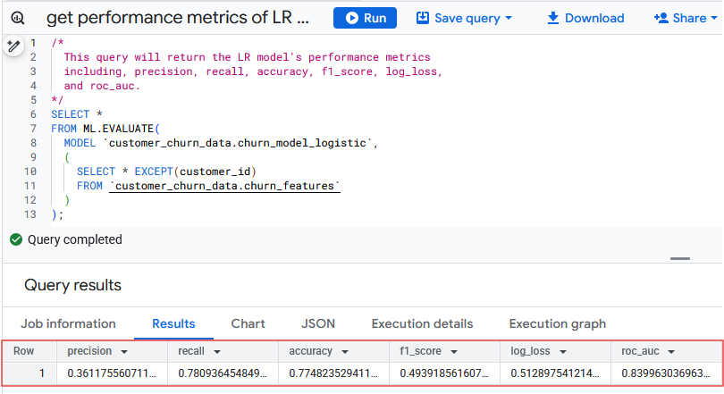 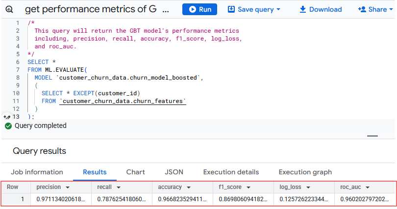


Customers are segmented into risk tiers based on churn probability:

**Low-Risk:** 0 - 0.40 (non-inclusive)

**Medium-Risk:** 0.40 - 0.70 (non-inclusive)

**High-Risk:** 0.70 - 1.00 (non-inclusive)


Power BI connects to BigQuery using Direct Query for real-time analysis.

### 4. Analyze & Visualize

Explore data distributions, correlations, and trends using visualizations to identify key churn drivers.

A star-schema data model is used since it's manageable for this dataset and to ensure filters apply correctly across visuals. 

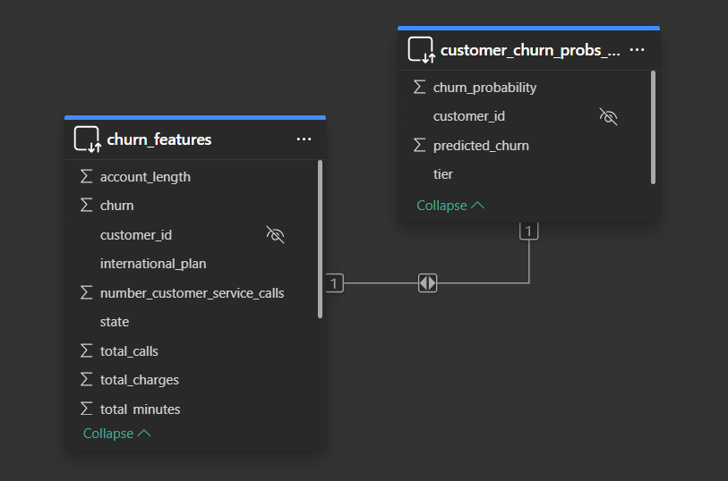

Insights are organized by sections below.

**Service Usage by Risk Tier**

| **Risk Tier** | **Total Charges** | **Total Calls** | **Total Minutes** |
| --- | --- | --- | --- |
| Low-Risk | $217,470.00 | 1,132,727 | 2,172,621.66 |
| High-Risk | $28,923.83 | 128,265 | 277,934.72 |
| Medium-Risk | $6,261.92 | 32,494 | 62,101.01 |

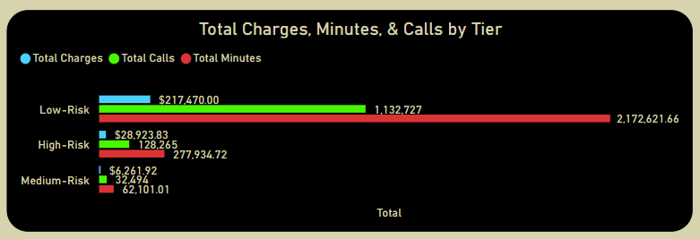

**Churn Insights by Plan Type and Risk Tier**

**Overall Insights:**

Total customers churned: 598

Overall churn rate: 14.07%

Revenue lost from churn: $39.19k

**Churn by Risk Tier:**

Low-Risk: 3,720 customers; 2.74% churn rate

Medium-Risk: 106 customers; 69.81% churn rate

High-Risk: 424 customers; 99.53% churn rate

**State Insights:**

New Jersey had the highest churn rate at 27.08%

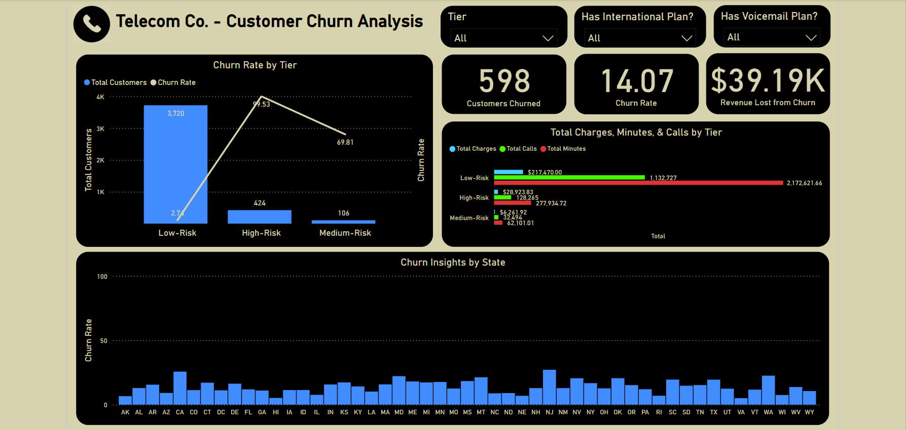

**Segment Insights:**

1. No International or Voicemail Plan

   - Churned: 383, Churn rate: 13.46%, Revenue loss: $26.11K

   - Churn Rate by Tier: High-Risk - 100%, Medium-Risk - 75%, Low-Risk - 2.26%
  
   - State Insights: Montana had the highest churn rate at 25.93%

   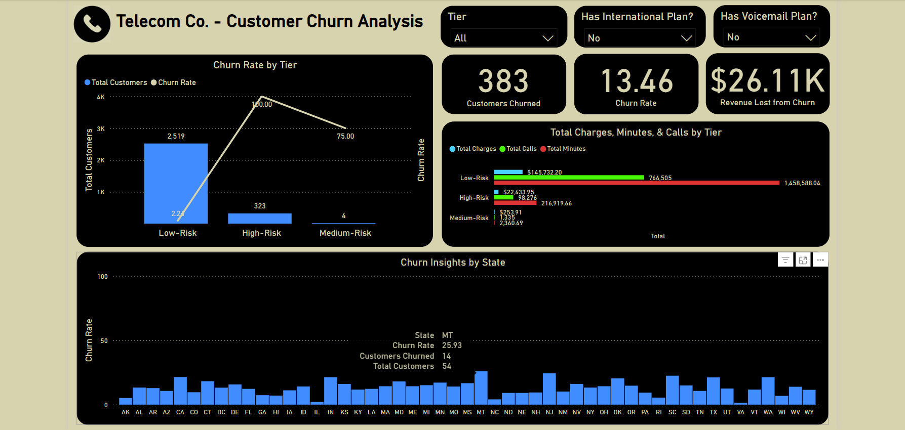

2. Only International Plan

   - Churned: 133, Churn rate: 45.55%, Revenue loss: $8.33K

   - Churn Rate by Tier: High-Risk - 98.33%, Medium-Risk - 73.08%, Low-Risk - 11.04%
  
   - State Insights: Customers in Iowa (IA), Maine (ME), & New Hampshire (NH) all churned (100%)
  
   

3. Only Voicemail Plan

   - Churned: 48, Churn rate: 4.76%, Revenue loss: $2.67K

   - Churn Rate by Tier: High-Risk - 100%, Medium-Risk - 100%, Low-Risk - 1.94%
  
   - State Insights: California had the highest churn rate at 25%
  
   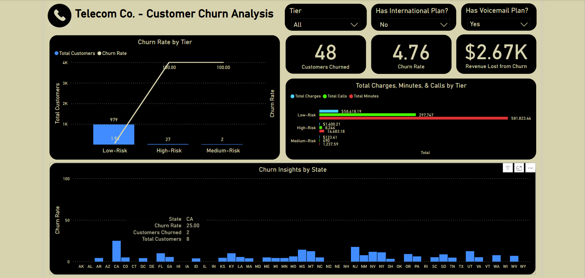

4. Both Plans

   - Churned: 34, Churn rate: 32.69%, Revenue loss: $2.09K

   - Churn Rate by Tier: High-Risk - 92.86%, Medium-Risk - 54.55%, Low-Risk - 13.24%
  
   - State Insights: Customers in Alabama (AL), Kentucky (KY), Massachusetts (MA), Maine (ME), Minnesota (MN), New Mexico (NM), Nevada (NV), Oregon (OR), Tennessee (TN), & Texas (TX) all churned (100%)
  
   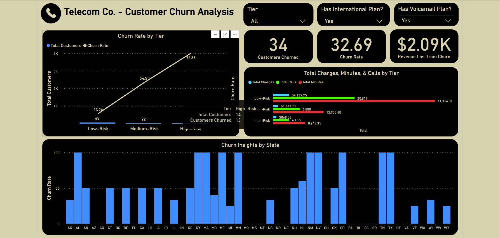

5. No International Plan (regardless of voicemail)

   - Churned: 431, Churn rate: 11.18%, Revenue loss: $28.77K

   - Churn Rate by Tier: High-Risk churn - 100%, Medium-Risk - 83.33%, Low-Risk: 2.17%
  
   - State Insights: New Jersey (NJ) and California (CA) had the highest churn rate at 22.99% and 22.22%
  
   

6. International Plan (with/without voicemail)

   - Churned: 167, Churn rate: 42.17%, Revenue loss: $10.41K

   - Churn Rate by Tier: High-Risk - 97.30%, Medium-Risk - 69%, Low-Risk -  11.71%
  
   - State Insights: Maine (ME) and New Hampshire (NH) had the highest churn rate at 100% and 83.33%
  
   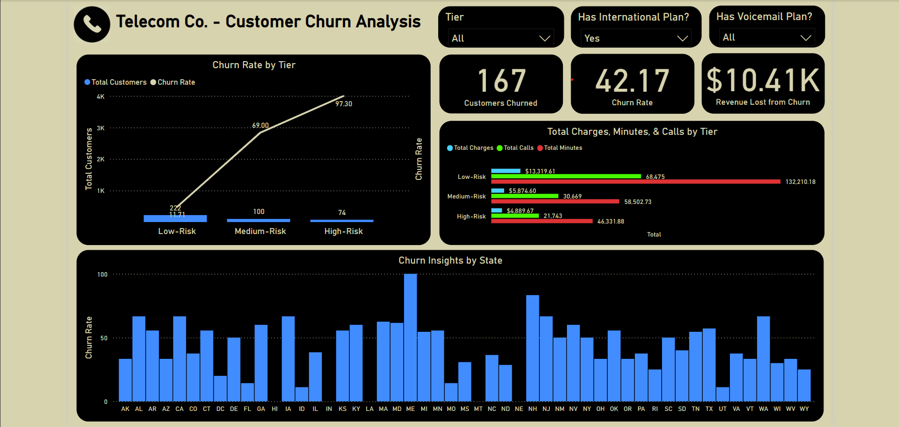

7. No Voicemail Plan (with/without international)

   - Churned: 516, Churn rate: 16.44%, Revenue loss: $34.43K

   - Churn Rate by Tier: High-Risk - 99.74%, Medium-Risk - 73.17%, Low-Risk - 2.77% 
  
   - State Insights: New Jersey (NJ) has the highest churn rate at 27.03%
  
   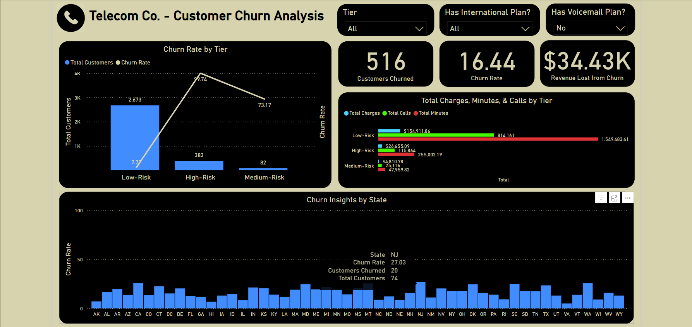

8. Voicemail Plan (with/without international)

   - Churned: 82, Churn rate: 7.37%, Revenue loss: $4.75K

   - Churn Rate by Tier: High-Risk - 97.56%, Medium-Risk - 58.33%, Low-Risk - 2.67%
  
   - State Insights: New Jersey (NJ) has the highest churn rate at 27.27%.
  
   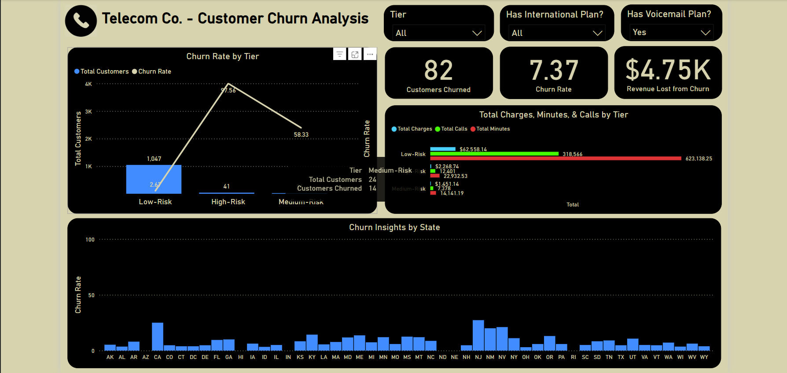

### Key Takeaways

High-Risk customers consistently churn at rates near or at 100%, especially those with international plans.

Voicemail plans are linked to lower churn rates, especially among Low and Medium-Risk groups.

International plans are a strong churn predictor, with over 42% of customers churning.

New Jersey frequently appears with the highest churn rate.

### Strategic Recommendations

1. **Prioritize Retention for Medium and High-Risk Segments**

   Focus on targeted outreach: retention offers, proactive support, loyalty rewards.

2. **Enhance International Plan Offerings**

   Bundle voicemail services or offer discounts for combined plans.

3. **Focus on At-Risk States**

   Target retention in high-churn states such as New Jersey, Maine, and New Hampshire. Investigate service or perception issues.

4. **Drive Engagement in Low-Usage Segments**

   Use personalized communication, onboarding support, and usage incentives.

### 5. Deploy & Monitor

BigQuery's built-in ML models and scheduler are used for automation.

Training queries run every Monday at 9:00 AM EST.

Export queries run at 10:00 AM EST.

Power BI reflects updates post-10:00 AM. Scheduling ends September 1, 2025, due to cloud budget limits.
