# Warehouse Performance Analysis - Part 1

## Data Analysis Process

### 1. Define the Problem
National Warehousing Inc., a U.S.-based supply chain company specializing in order fulfillment and storage, seeks to evaluate the performance of its warehouse branches and analyze customer behavior to reduce costs, improve operational efficiency, and enhance customer satisfaction.

### 2. Collect & Store the Data
The data for this analysis was already in BigQuery and it is also where the 1st phase of this analysis will be performed. The `Orders` table has columns: `order_id`, `customer_id`, `warehouse_id`, `order_date`, and `shipped_date`. The `Warehouse` table has columns: `warehouse_id`, `warehouse_alias`, `maximum_capacity`, `employee_total`, and `state`. These tables will be joined multiple times on the `warehouse_id` column to extract key insights for this analysis.

**Table Dimensions**:

|||
|---|---|
|Orders - 10,000 x 5|Warehouse - 10 x 5|

There will also be 7 additional tables from queries below that will be used in Power BI to visualize the results.

### 3. Clean & Prepare the Data
The table, `Orders`, appeared clean at first glance but when I sorted it by the `order_date` column, I spotted an outlier with a date of 2023-09-01.   

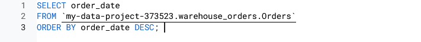   
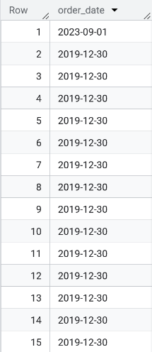  

So, to check if this was a valid record or not, I checked to see when was the table last updated and the date read 2-27-2023.  

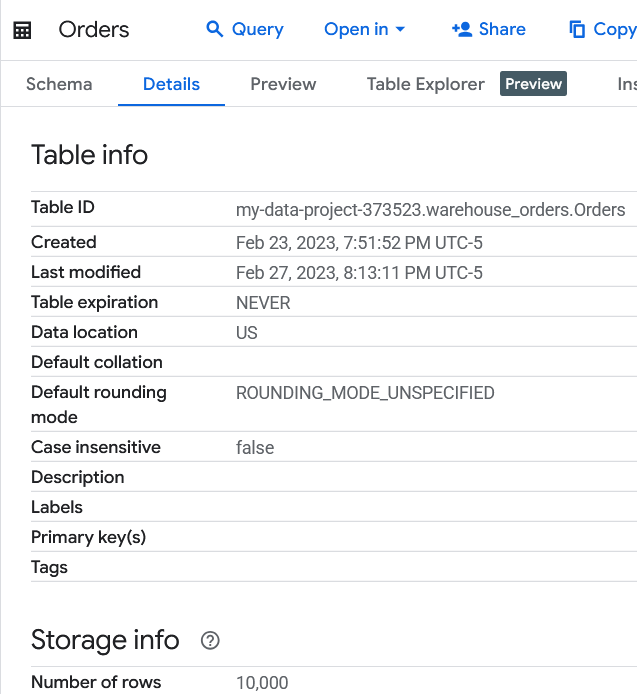   

To handle this one row, I simply excluded it using the `WHERE` clause in all of the queries.  

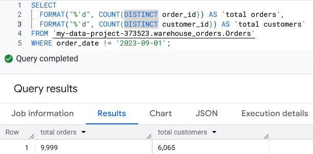   

In Power BI:  
I filtered the row out of the data set using the Power Query Editor.  

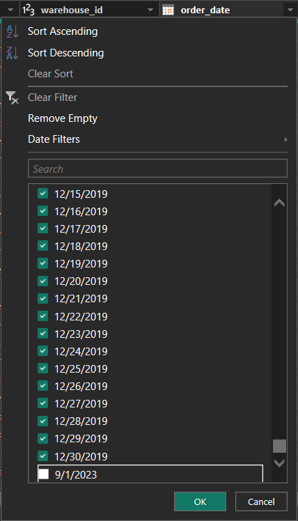   

I also had to remove the comma from the `number of orders` column in the `warehouse-total-orders` table to transform the value from string to number.
|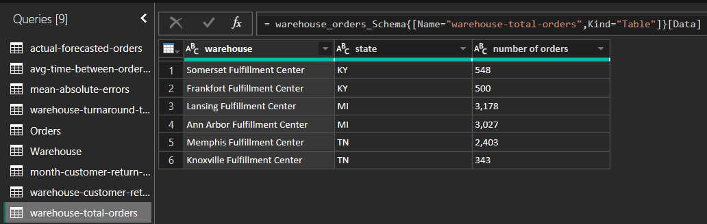|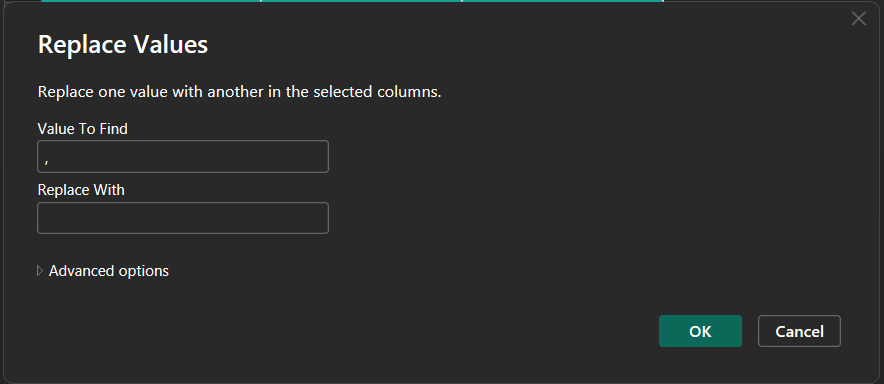|
|---|---|  
|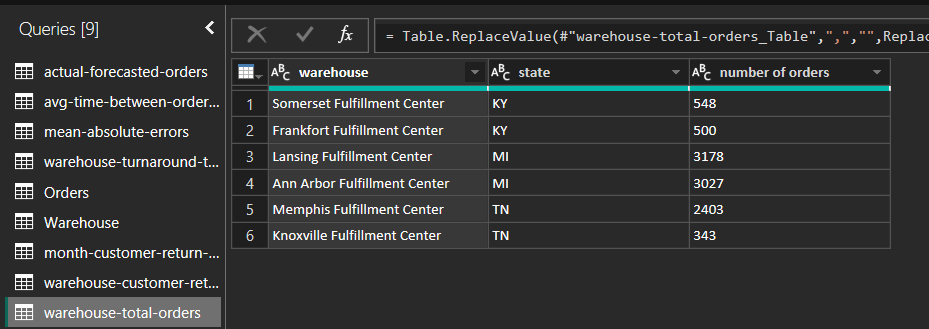|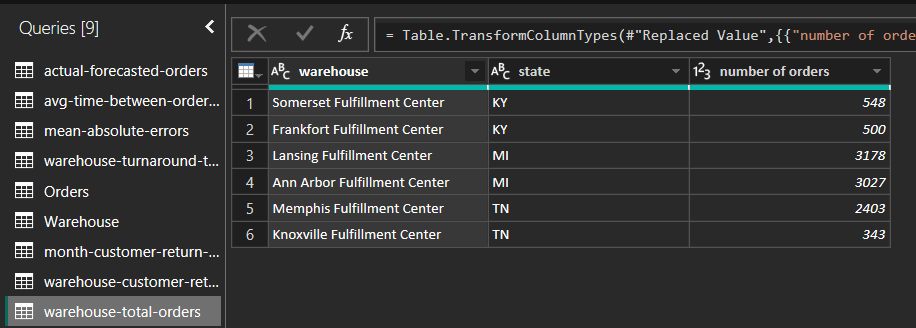|

### 4. Analyze the Data
What are the total orders and customers?  

   
 
What's the amount of shipments per warehouse?    

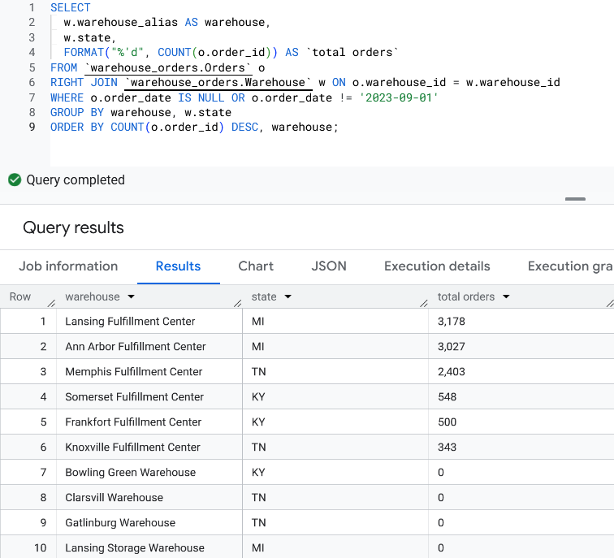   

What's the capacity being wasted at the warehouses with no shipments?  

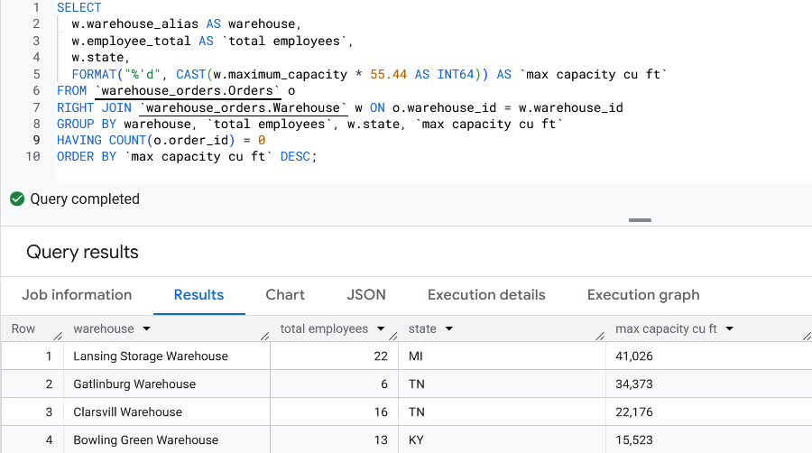   

How many orders are these warehouses getting each month?  

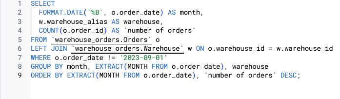   
|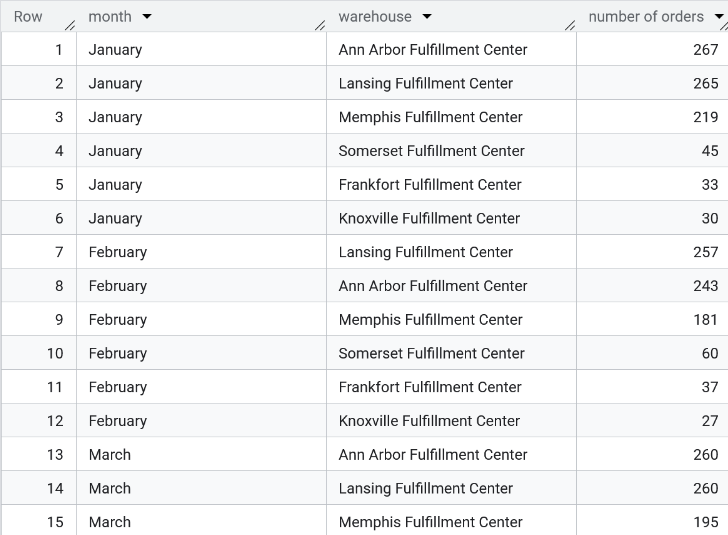| 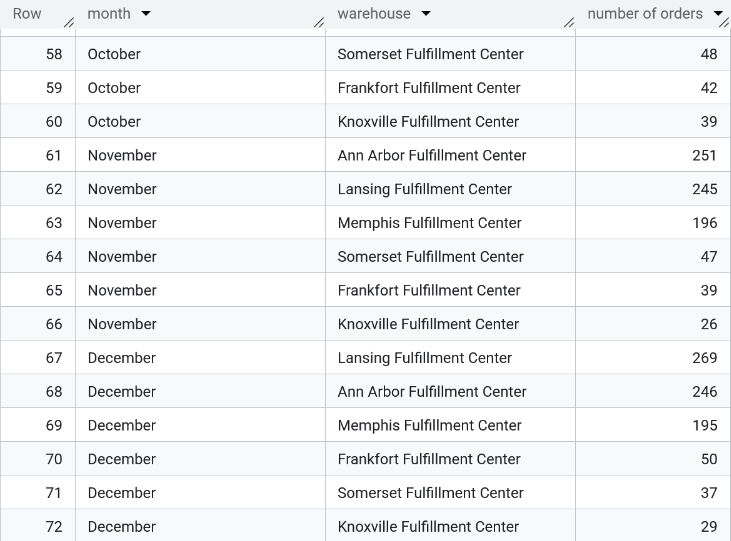|
|---|---|  

How fast are these orders being processed?
|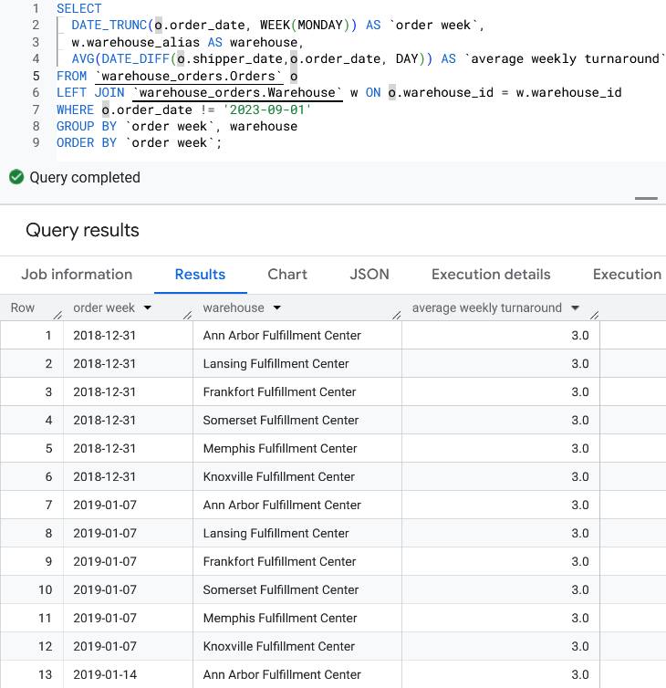||
|---|---|  

Rank warehouses based off of the average number of orders per week & month
|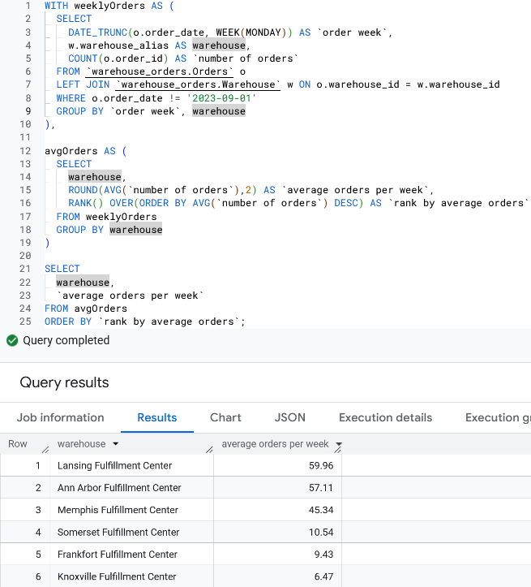|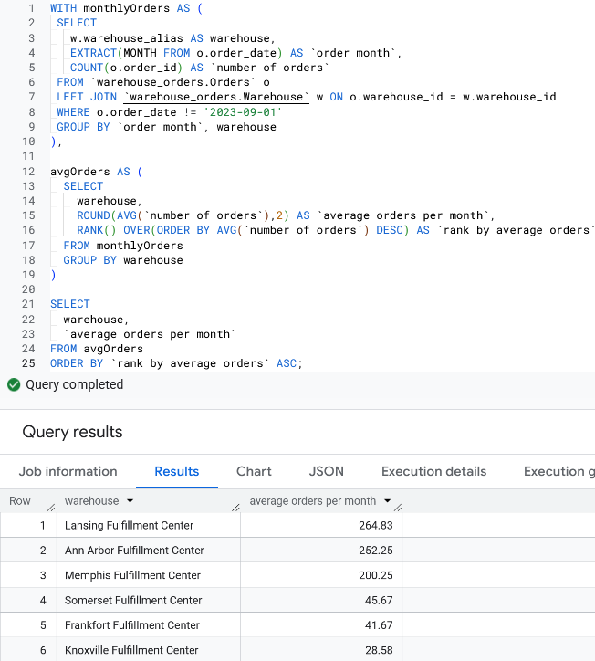|
|---|---|  

Get a 5-day forecast for orders (Monday-Friday); edited the query so that the first week did not have NULL values
||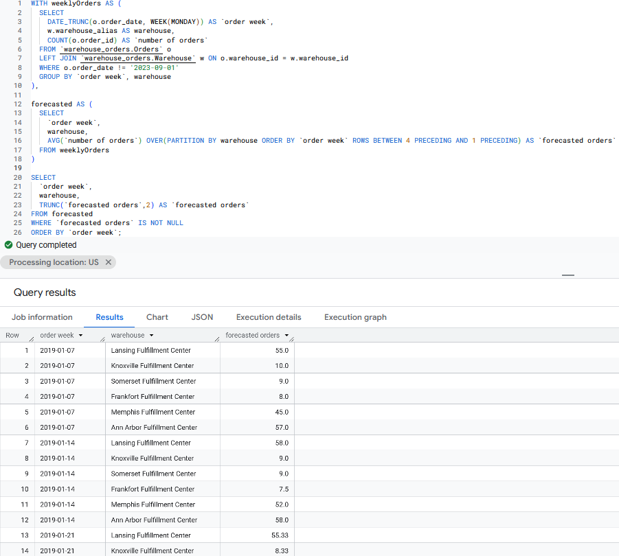|
|---|---|  

Compare actual amount of orders to 5-day forecasted amount of orders  

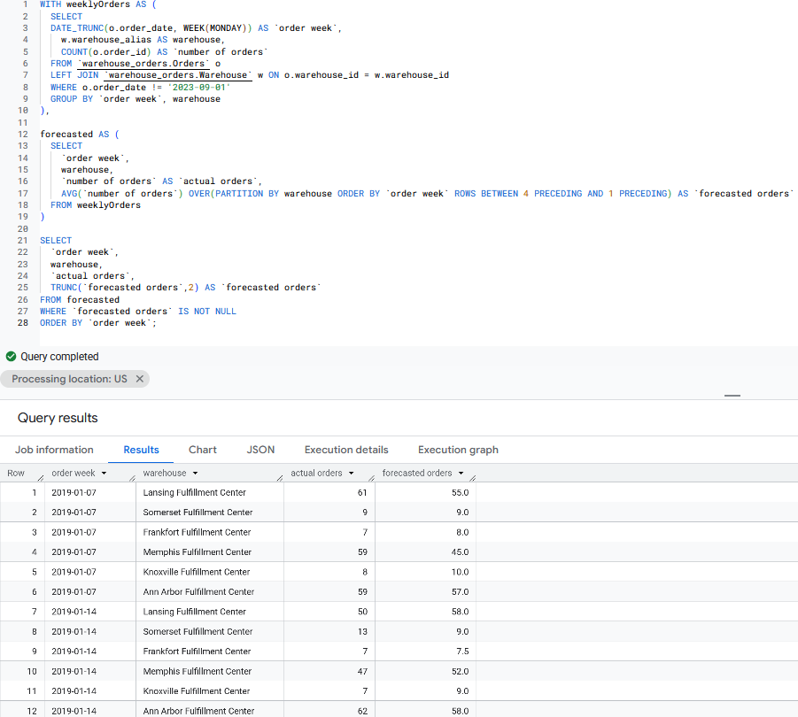   

Which warehouses have orders that either meet or are close to the amount of forecasted orders (have the smallest mean absolute error)?
Note, there is the MAE before and after I filtered out the order with a date of 2023-09-01  

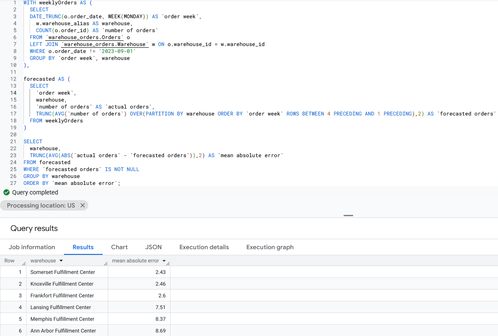   
|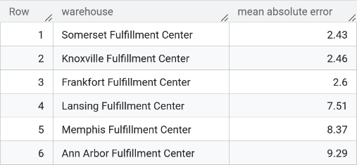|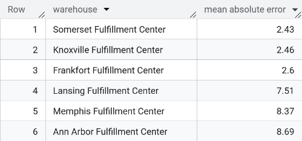|
|---|---|  

There's a .6 difference in the MAE for the Ann Arbor facility just because of that one row.  

What is the company-wide retention rate (percentage of returning customers)?  

   

How Frequently Do Individual Customers Reorder (Repeat Purchase Cycle)?  
|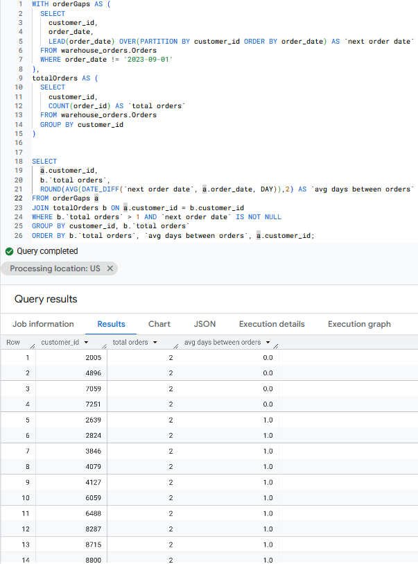|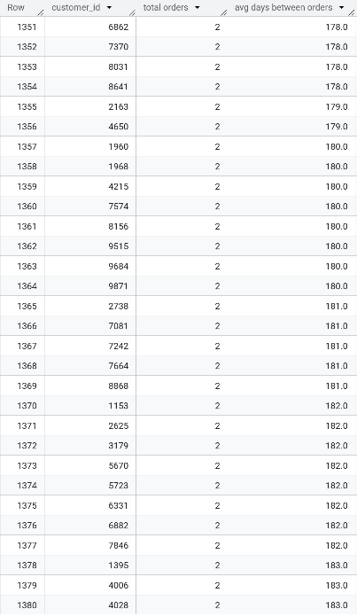|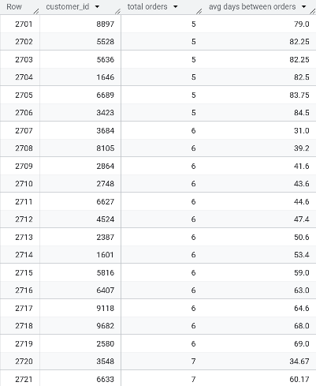|
|---|---|---|  

There are 2,721 returning customers; avg days between orders ranges from 0.0 - 348.0; Customers with more orders have less days between orders

Get the customer return frequency over the year  

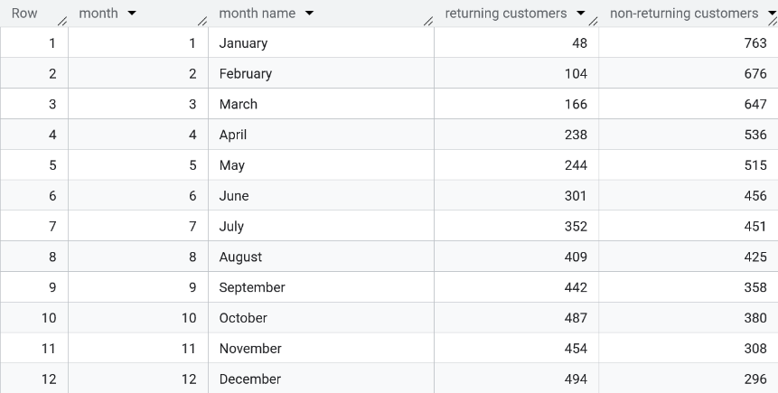   

Get the customer return frequency for each warehouse  

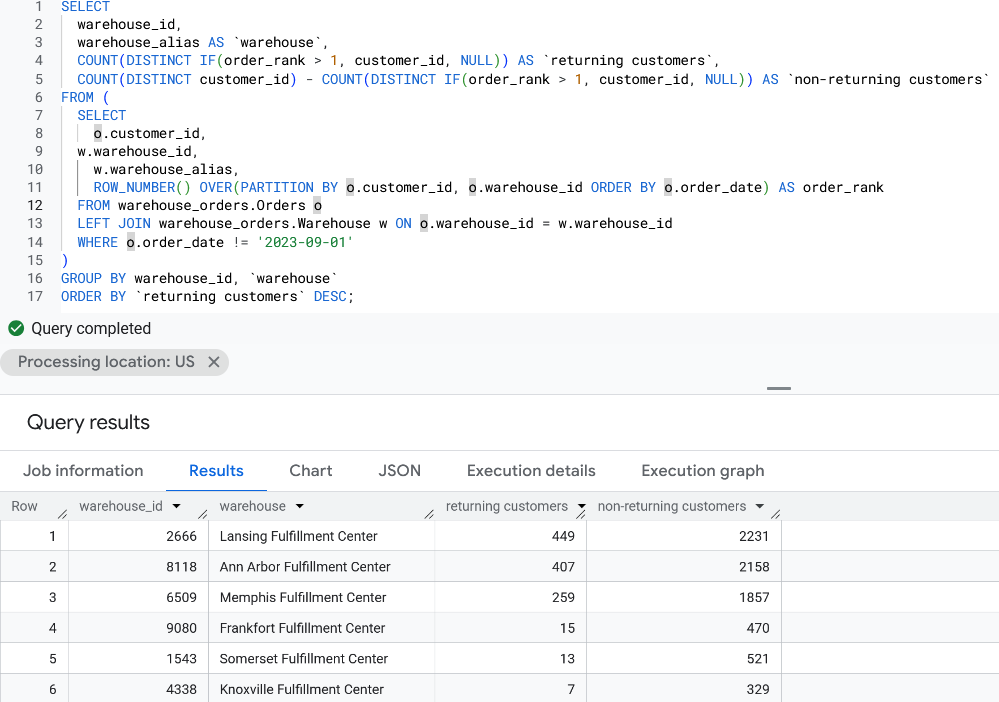   
 
**Steps 5 & 6 for this analysis will continue [here](https://github.com/ShaunJPartridge/Data-Analytics-Portfolio/tree/main/Power%20BI/Warehouse%20Performance%20Analysis)**
