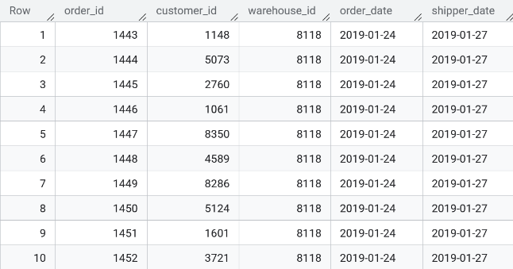
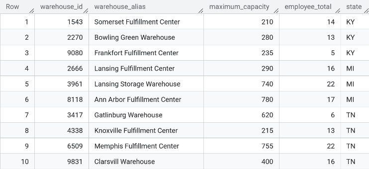

# Warehouse Performance Analysis

## Data Analysis Process

### 1. Define the Problem
National Warehousing Inc., a U.S.-based supply chain company specializing in order fulfillment and storage, seeks to evaluate the performance of its warehouse branches and analyze customer behavior to reduce costs, improve operational efficiency, and enhance customer satisfaction.

### 2. Collect & Store the Data
The data for this analysis was already in BigQuery and it is also where the 1st phase of this analysis will be performed. The two tables are `Orders` and `Warehouse` in the dataset, `warehouse_orders`.

**Table Dimensions**:

|||
|:-:|:-:|
|Orders - 10,000 x 5|Warehouse - 10 x 5|

### 3. Clean & Prepare the Data

### 4. Analyze the Data

### 5. Share & Visualize Results

### 6. Act (Draw Conclusions & Recommend Actions)

## Key Takeaways: