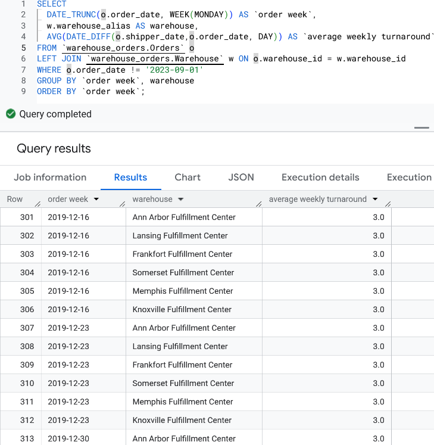

# Warehouse Performance Analysis

## Data Analysis Process

### 1. Define the Problem
National Warehousing Inc., a U.S.-based supply chain company specializing in order fulfillment and storage, seeks to evaluate the performance of its warehouse branches and analyze customer behavior to reduce costs, improve operational efficiency, and enhance customer satisfaction.

### 2. Collect & Store the Data
The data for this analysis was already in BigQuery and it is also where the 1st phase of this analysis will be performed. The two tables are `Orders` and `Warehouse` in the dataset, `warehouse_orders`.

**Table Dimensions**:

|||
|:-:|:-:|
|Orders - 10,000 x 5|Warehouse - 10 x 5|

### 3. Clean & Prepare the Data
The table, `Orders`, appeared clean at first glance but when I sorted it by the `order_date` column, I spotted an outlier with a date of 2023-09-01.   
   
  

So, to check if this was a valid record or not, I checked to see when was the table last updated and the date read 2-27-2023.  
   

To handle this one row, I simply excluded it using the `WHERE` clause in all of the queries.  
   

In Power BI, I filtered the row out of the data set using the Power Query Editor.  
   

### 4. Analyze the Data
What are the total orders and customers?  
   

What's the amount of shipments per warehouse
   
What's the amount of shipments per warehouse  
   

What's the capacity being wasted at the warehouses with no shipments?  
   

How many orders are these warehouses getting each month?  
   
|| |
|---|---|  

How fast are these orders being processed?
|||
|---|---|  

Rank warehouses based off of the average number of orders per week & month
|||
|---|---|  

### 5. Share & Visualize Results

### 6. Act (Draw Conclusions & Recommend Actions)

## Key Takeaways:
